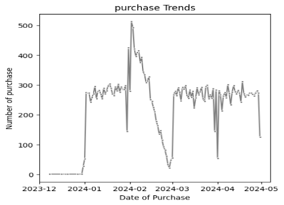
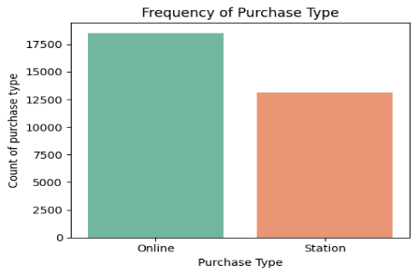
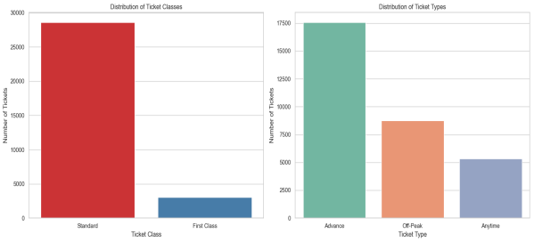
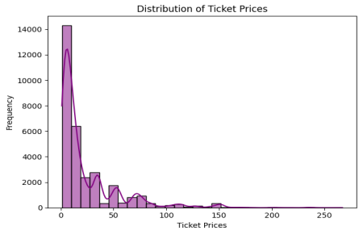
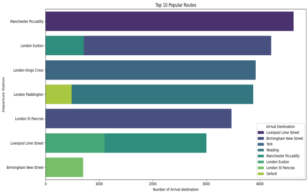
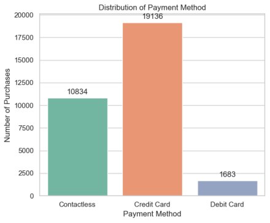
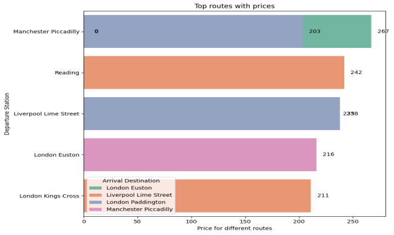

# Prediction of Train Rides Journey Statuses

## Introduction
The UK railway system is a vital component of the country's transportation infrastructure, facilitating millions of journeys annually. Understanding the dynamics of train rides can provide insights into operational efficiency, passenger behavior, and areas for improvement.
The sole purpose of analyzing this dataset is to determine the Journey status either on-time or delayed due to several conditions; Purchase Type', 'Payment Method', 'Railcard', 'Ticket Class', 'Ticket Type', 'Price', 'Departure Station', 'Arrival Destination', 'Reason for Delay'.
There are several reasons for delay; signal failure, Technical issues, weather conditions, staff shortage, staffing and traffic.
## Dataset Description
### Source and Time Period
The dataset contains information about 31653 rows and 18 columns. This dataset contains detailed information about train ticket purchases and journeys in the UK. It covers a specific time period, providing a snapshot of the railway system's operations. The dataset being used is an open sourced dataset obtained from maven analytics can be downloaded from this Github link and here.  The python notebook for analysis can be downloaded here.
Here's a brief description of the columns:
1. Date of Purchase: The date the ticket is obtained.
2. Time of Purchase: The time the ticket is purchased
3. Purchase Type: The purchase type represents the mode of payment either it was made ‘online’ and ‘station’.
4. Payment Method: This refers to the type of method that was used for payment.
5. Railcard: 
6. Ticket Class: This refers to the type of ticket that was booked (standard/ First class).
7. Ticket Type: The type of ticket for the ride.
8. Price:  This refers to how much was paid to board a train.
9. Departure Station: This is where the train took off / Passengers boarded a train
10. Arrival Destination: This is the passenger’s chosen destination
11. Date of Journey: This is the date where the train is expected to depart the station.
12. Departure Time: This refers to the when the train is expected to depart its station.
13. Arrival Time: This is the time when the train reaches its destination
14. Actual Arrival Time: This is very similar to the ‘arrival time’ however, some entries are a little different, which shows the accurate time the train reaches its destination.
15. Journey Status: This describes if the trin would be delayed or on-time.
16. Reason for Delay: This refers to several conditions which would result the train being delayed.
17. Refund Request: This refers to whether the passenger has received a refund which is independent of the journey status.
## PROBLEM STATEMENT
The UK rail station is a very important means of transportation among the brits having over 2000 railway stations, transporting millions daily.
However, passengers are faced with different challenges such as delays in departure and pricing which leads to passenger’s dissatisfaction and hence inefficient use of the railway stations.
Objectives
- Analyze purchase patterns and journey characteristics by performing EDA
- Identify factors affecting ticket prices and delays
- Provide actionable insights and recommendations for operational improvements.
## Data Preparation and Cleaning
I will begin with data preparation and cleaning. I'll handle missing values, convert date and time columns to appropriate formats, and ensure data consistency.
The dataset has been successfully cleaned, with all missing values addressed. The date and time columns have been converted to appropriate formats, and we are ready to proceed with the analysis. Click here
## Exploratory Data Analysis (EDA)
### Purchase Patterns
I will be analyzing the trends in ticket purchases over time, the distribution of purchase types, and payment methods.
### Trends in Ticket Purchases Over Time
This plots the number of ticket purchases over time to identify any patterns or trends. The graph below shows the payment distribution over time with February being the highest.

### Distribution of Purchase Types
Let’s look at the distribution of different payment methods used for ticket purchases, in the diagram below we have two different purchase patterns which is either done online or in the station. We can see that most payment were done online and some were also done at the station.

### Ticket Characteristics
### Analysis of Ticket Classes and Types
Analyzing the distribution of different ticket classes and types to understand customer preferences.
The ticket class describes the type of ticket purchased by consumers with Standard class being prominent among the two classes of tickets.
The Ticket type refers to when the ticket was bought or when the user can use the ticket, Advance ticket is 1/2 off and must be purchased at least a day prior to departure. Off-Peak tickets are 1/4 off and some users tickets are labeled ‘anytime’.

### Distribution of Ticket Prices

The distribution of ticket prices to understand the pricing structure. We utilize a histogram chart to understand different amount that was paid by passengers. There is a variation in prices from passengers which is shown below;

### Journey Analysis
### Geographical Distribution of Journeys
Analyzing the most popular routes and stations. This shows the popular routes with their respective arrival destination, the analysis involves displaying the top 10 departure and arrival station with Manchester piccadilly to Liverpool lime street being very popular.

### Analysis of Journey Status
We'll look into the journey statuses to understand the proportion of on-time vs. delayed journeys. The journey status for passengers is either delayed, cancelled or on-time. The passengers have 1180 cancelled journey, 2292 delayed and 27481 on-time journeys, the focus will be when the journey is “delayed” or “cancelled”. Analysis is carried out to determine why the journey status is delayed or cancelled, weather and technical issues are the major reason for the train being delayed with counts being 758 and 472 respectively while Signal failure is the main reason the journey status is cancelled.
### Distribution of Payment Method
This describes the type of payment method which was predominantly used, consumers made use of their credit cards compared to other means of payment.
The least form of payment was the use of “Debit Card” for payment with 1,683 counts of users.

### Expensive Routes
This describes the top routes with their respective Prices. The most expensive route is Manchester piccadilly to London Euston with 267 being the ticket price while subsequent routes are ‘Reading’ to ‘Liverpool Lime Street’, ‘Liverpool Lime’ street to ‘London Paddington’, ‘London Euston to Manchester Piccadilly’, ‘London Kings Cross’ to ‘Liverpool Lime street’.
Manchester Piccadilly is the departure station with some of the highest ticket prices with London Euston being the arrival destination with 203.

### Missing Values
The dataset has missing values in the following columns:
- Reason for Delay: 27481 missing values
- Actual arrival time: 1880 missing values
- Railcard: 20918 missing values
### Data Cleaning
The dataset has been thoroughly cleaned and pre-processed as follows:
- Missing Values: Missing Values in the reason for delay, actual arrival time and railcard columns were observed that if the journey status is ‘On-time’ the reason for delay is filled with ‘Nan’ hence it was filled with ‘None’.
The actual arrival time frequently differs from the arrival time, so this was also filled with None as the arrival time would suffice since it is not empty.
- Encoding Categorical Variables: All categorical variables have been converted to numerical format using one hot encoder and label encoder is used for the target variable.
- Feature Scaling: The feature ‘Price’ has been standardized using StandardScaler to ensure better performance of machine learning model.
The cleaned dataset now consists of 31653 entries and 9 columns with the price column being standardized, making it ready for any subsequent analysis or modeling tasks.
## Predictive Analysis
Different models are trained to see the model with the best performance, and I also performed cross validation technique using ‘kfold’. Random forest classifier tends to perform better, with better performance to predict whether the journey status is on-time, delayed or cancelled. See the python script above for prediction.
## Model Results
Data comes in the form of features and outcome, we want to build an algorithm that takes feature values as input and returns a prediction when we don’t know the actual outcome. Before modeling it is required that columns which does not influence the status of the journey are dropped, 8 columns were dropped before training the model.
I used 80% while training the data and 20% for testing, this was done with the help of python libraries like ‘scikit’ learn.
Number of folds were set to ten, in which each are designed to run like a loop and it iterates over the rest till the number of iterations are complete. Four models were trained; KNN, Logistic regression, Random Forest, Random Tree Classifiers. 
Random forest returned an accuracy of 98.9%. 

## Model Deployment
This model is deployed using streamlit, an open-source python framework which requires no front-end experience. The model returns the prediction of the train journey status (on-time, delayed or cancelled) based on features selected.
## Conclusion
The exploration of the ‘UK train rides” dataset reveals the potential of machine learning in predicting journey status with reasonable accuracy. The predictive analysis displays the ability to differentiate when a journey is on-time, delayed or cancelled.
The model showed promise, it also underscored the challenges in classification tasks, particularly with limited datasets.

